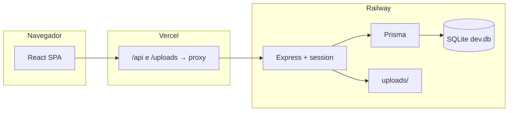

# Documentação técnica — PX Data Reembolsos

Documento para **desenvolvedores e operações**: arquitetura, configuração, API, dados e deploy.

**Relacionado:** [Documentação de produto](./DOCUMENTACAO_PRODUTO.md) · [Deploy Vercel](./DEPLOY_VERCEL.md) · [Deploy API](./DEPLOY_API.md)

---

## 1. Arquitetura de produção



| Camada | Tecnologia | URL produção |
|--------|------------|--------------|
| Front | React 18, Vite 6, Tailwind, Radix UI | https://pxdata-reembolsos.vercel.app |
| API | Express, express-session, Multer, Prisma | https://pxdata-reembolsos-production.up.railway.app |
| Banco | SQLite (`prisma/dev.db`) | Volume persistente no Railway |
| Arquivos | Disco `uploads/` | Volume persistente no Railway |

**Proxy Vercel:** `vercel.json` encaminha `/api/*` e `/uploads/*` para a Railway. No browser, `apiUrl()` usa paths relativos (`/api/...`) em produção — cookies de sessão ficam no domínio da Vercel (same-origin), essencial para mobile.

**Desenvolvimento:** `npm run dev` — Vite `:5173` + API `:3001`; proxy local em `vite.config.ts`.

---

## 2. Stack e estrutura

| Caminho | Conteúdo |
|---------|----------|
| `src/` | SPA React (páginas, componentes, hooks, `lib/`, `types/`) |
| `server/index.ts` | API Express (auth, reembolsos, admin, uploads) |
| `server/buildAdminReimbursementDetail.ts` | JSON admin com anexos por despesa |
| `server/exportExpenseSpreadsheet.ts` | Export Excel (Nota Débito) |
| `server/extractLab.ts` | OCR/extração de comprovantes |
| `prisma/schema.prisma` | Modelos SQLite |
| `vercel.json` | Rewrites: proxy API + SPA fallback |
| `Dockerfile` | Imagem só da API (Railway) |

**Scripts principais:** `npm run dev`, `npm run build`, `npm start` (migrate + API).

---

## 3. Variáveis de ambiente

### Railway (API)

| Variável | Exemplo / uso |
|----------|----------------|
| `GOOGLE_CLIENT_ID` | Mesmo ID do cliente OAuth Web |
| `SESSION_SECRET` | String longa aleatória |
| `CLIENT_ORIGIN` | `https://pxdata-reembolsos.vercel.app` (vírgula se múltiplas origens) |
| `ADMIN_EMAILS` | E-mails admin separados por vírgula |
| `TRUST_CROSS_SITE_SESSION` | `1` |
| `NODE_ENV` | `production` |
| `PORT` | Injetado pelo Railway |

**Exemplo `ADMIN_EMAILS` (repositório / `.env.example`):**

```
financeiro@pxdata.ai,mayco@pxdata.ai,bpofinanceiro@glip.com.br
```

A lista efetiva em produção é **somente** a variável no Railway — alterações no código ou `.env.example` não concedem admin até atualizar o Railway e redeploy.

### Vercel (front)

| Variável | Uso |
|----------|-----|
| `VITE_GOOGLE_CLIENT_ID` | Igual a `GOOGLE_CLIENT_ID` |
| `VITE_API_BASE_URL` | Opcional em prod (browser usa `/api` relativo via proxy) |

### Google Cloud Console

**Origens JavaScript autorizadas:**

- `http://localhost:5173`
- `https://pxdata-reembolsos.vercel.app`

**URIs de redirecionamento autorizados (login mobile):**

- `https://pxdata-reembolsos.vercel.app/api/auth/google/callback`
- `https://pxdata-reembolsos-production.up.railway.app/api/auth/google/callback`

---

## 4. Autenticação

### Fluxo desktop (popup)

1. `GoogleLogin` retorna JWT (`credential`)
2. `POST /api/auth/google` com JSON `{ credential }`
3. Servidor valida com `google-auth-library`
4. `req.session.save()` → cookie `reembolso.sid`

### Fluxo mobile (redirect)

1. `GoogleLogin` com `ux_mode=redirect`
2. Google POST form-urlencoded para `login_uri` → `/api/auth/google/callback` (via proxy Vercel)
3. Servidor valida, grava sessão, redirect 302 para `CLIENT_ORIGIN`

### CORS

- Rotas `POST /api/auth/google` e `POST /api/auth/google/callback` **ignoram** CORS estrito (navegação do Google)
- Demais rotas: `CLIENT_ORIGIN` + `https://accounts.google.com`

### Cookie de sessão

- Nome: `reembolso.sid`
- `httpOnly`, 7 dias, `secure` em produção
- `sameSite: none` se `TRUST_CROSS_SITE_SESSION=1`; com proxy Vercel, same-origin usa cookie no domínio da Vercel

### Admin

`requireAdmin` compara `req.session.user.email` com lista `ADMIN_EMAILS` (trim, case-sensitive).

---

## 5. API — referência resumida

Base em dev: `/api` (proxy Vite). Em prod (browser): `/api` (proxy Vercel).

### Auth

| Método | Rota | Descrição |
|--------|------|-----------|
| `GET` | `/api/auth/me` | Usuário da sessão |
| `POST` | `/api/auth/google` | Login JSON (desktop) ou redirect form POST |
| `POST` | `/api/auth/google/callback` | Callback redirect mobile |
| `POST` | `/api/auth/logout` | Encerra sessão |
| `GET` | `/api/auth/is-admin` | `{ isAdmin }` |

### Reembolsos

| Método | Rota | Descrição |
|--------|------|-----------|
| `GET` | `/api/reimbursements` | Lista do usuário logado |
| `POST` | `/api/reimbursements` | Multipart: `payload` (JSON) + `files[]` |
| `POST` | `/api/receipts/extract` | OCR/extração de um comprovante |

**Payload `expenses[]`:** `description`, `expenseLine`, `accountCode?`, `amount`, `observation?`

### Admin

| Método | Rota | Descrição |
|--------|------|-----------|
| `GET` | `/api/admin/reimbursements` | Lista completa |
| `GET` | `/api/admin/reimbursements/:id` | Detalhe + despesas + anexos + observação |
| `PATCH` | `/api/admin/reimbursements/:id/status` | `{ status }` |
| `GET` | `/api/admin/metrics` | Dashboard |
| `GET/PUT` | `/api/admin/company` | Dados da empresa |

IDs públicos: `REIMB-0001` (formato `REIMB-` + 4 dígitos).

---

## 6. Modelo de dados (Prisma)

```
CompanySettings (id=1) — dados da PX
Reimbursement — solicitação (ownerGoogleSub, status, totalAmount)
Expense — linha (description, expenseLine, accountCode, amount, observation?)
Attachment — comprovante (expenseId?, storedPath, mimeType)
```

**Migração recente:** `Expense.observation` (TEXT opcional) — `20260702120000_expense_observation`.

---

## 7. Front-end — rotas

| Rota | Página |
|------|--------|
| `/` | Login, formulário, histórico (`?view=list`) |
| `/admin` | Painel admin (despesas / dashboard) |
| `/admin/empresa` | Configuração da empresa |

**Hooks:** `useAuth`, `useReimbursementForm`  
**Helpers:** `src/lib/apiBase.ts` (`apiUrl`, `googleAuthCallbackUrl`), `src/lib/isMobileBrowser.ts`

---

## 8. Deploy

1. **Push `main`** → Railway redeploy API (Dockerfile) + Vercel rebuild front
2. Railway: volume em `/app/prisma` e `/app/uploads`
3. Vercel: redeploy após mudar variáveis `VITE_*`
4. Google Cloud: salvar origens/redirects; aguardar propagação (~5 min)

Ver guias detalhados: [DEPLOY_VERCEL.md](./DEPLOY_VERCEL.md), [DEPLOY_API.md](./DEPLOY_API.md).

---

## 9. Segurança — checklist

- [ ] `.env` fora do Git
- [ ] `SESSION_SECRET` forte
- [ ] `ADMIN_EMAILS` só contas corporativas
- [ ] HTTPS em produção
- [ ] Backup `dev.db` + `uploads/` no Railway
- [ ] Revisar exposição de `/uploads` (URLs públicas na API)

---

## 10. Troubleshooting

| Sintoma | Causa comum | Ação |
|---------|-------------|------|
| `Not allowed by CORS` no login mobile | Redirect Google bloqueado | Código atual ignora CORS nessas rotas; redeploy Railway |
| Railway "Not Found" | URL errada no proxy | Conferir `vercel.json` e domínio Railway |
| Login volta pra tela inicial | Cookie não persiste | Proxy Vercel ativo; `TRUST_CROSS_SITE_SESSION=1` |
| `origin_mismatch` Google | URL não autorizada | Adicionar origem exata no Google Console |
| Admin não aparece | E-mail fora de `ADMIN_EMAILS` | Atualizar variável no Railway |

---

*Última atualização: julho/2026.*
