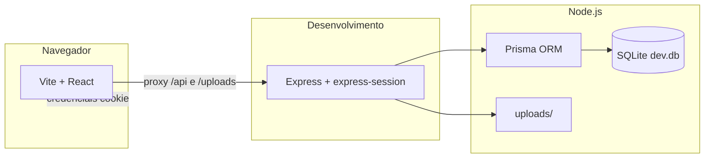

# Documentação técnica — PX Data Reembolsos

Documento para **desenvolvedores e operações**: arquitetura, configuração, API, dados e convenções do repositório.

**Relacionado:** [Documentação de produto](./DOCUMENTACAO_PRODUTO.md) · [Deploy Vercel (front)](./DEPLOY_VERCEL.md) · [Deploy da API (Docker / Railway)](./DEPLOY_API.md)

---

## 1. Arquitetura

- **Front-end:** React 18, TypeScript, Vite 6, Tailwind CSS, componentes estilo shadcn (Radix), React Router 7, Sonner.
- **Back-end:** um único processo Express (`server/index.ts`), executado com `tsx` (TypeScript no Node, ESM).
- **Persistência:** SQLite via Prisma; arquivos em disco sob `uploads/` (relativo à raiz do projeto).
- **Desenvolvimento:** `npm run dev` sobe API (porta **3001**) e Vite (**5173**); o Vite **proxy** encaminha `/api` e `/uploads` para a API (cookies e uploads funcionam no mesmo host do browser).
- **Produção (Vercel + API separada):** o front usa `VITE_API_BASE_URL` e o helper `src/lib/apiBase.ts` (`apiUrl` / `assetUrl`). Na API, `TRUST_CROSS_SITE_SESSION=1` e `CLIENT_ORIGIN` com a URL do front. Ver [DEPLOY_VERCEL.md](./DEPLOY_VERCEL.md).

---

## 2. Estrutura de pastas (relevante)

| Caminho | Conteúdo |
|---------|----------|
| `src/` | Aplicação React (`main.tsx`, `App.tsx`, páginas, componentes, hooks, `lib/`, `types/`) |
| `src/components/ui/` | Primitivos de UI (Button, Input, Select, etc.) |
| `src/components/reimbursement/` | Formulário e listas de reembolso |
| `src/components/admin/` | Painel admin, dashboard, empresa, modal de e-mail |
| `server/index.ts` | Rotas HTTP, auth, multer, estáticos |
| `server/buildAdminReimbursementDetail.ts` | Montagem do JSON de despesas + anexos (incl. legado sem `expenseId`) |
| `server/extractLab.ts` | Extração de texto / hints para o lab |
| `server/session.d.ts` | Extensão de tipos `express-session` |
| `prisma/schema.prisma` | Modelos e URL do SQLite |
| `prisma/migrations/` | Migrações versionadas |
| `uploads/` | Comprovantes persistidos (gitignored em produção típica) |
| `docs/` | Documentação de produto e técnica |

**Alias TypeScript / Vite:** `@/*` → `src/*` (ver `tsconfig.json` e `vite.config.ts`).

---

## 3. Requisitos e scripts

- **Node.js** compatível com as dependências do `package.json` (recomendado LTS atual).
- **npm** (ou pnpm/yarn, não documentado aqui).

| Script | Descrição |
|--------|-----------|
| `npm run dev` | API (`tsx watch server/index.ts`) + Vite em paralelo (`concurrently`) |
| `npm run dev:client` | Somente Vite |
| `npm run dev:server` | Somente API |
| `npm run build` | Build de produção do front (`dist/`) |
| `npm run preview` | Servir `dist/` (sem proxy; para API completa use deploy com proxy reverso) |
| `npm run db:generate` | `prisma generate` |
| `npm run db:migrate` | `prisma migrate dev` |
| `npm run db:push` | `prisma db push` (sem histórico de migração) |

**Typecheck:** `tsconfig.json` inclui apenas `src/`; o servidor não é emitido pelo `tsc` do projeto — validação ocorre via `tsx` em runtime. Opcional: `npx tsc --noEmit` pode reportar avisos se estender o `include`.

---

## 4. Variáveis de ambiente

Arquivo na **raiz**: `.env` (modelo em `.env.example`). Principais chaves:

| Variável | Onde lê | Uso |
|----------|---------|-----|
| `GOOGLE_CLIENT_ID` | Servidor | Validação do token JWT do Google (`google-auth-library`) |
| `VITE_GOOGLE_CLIENT_ID` | Front (build-time) | `GoogleOAuthProvider` / `GoogleLogin` — **deve ser igual** a `GOOGLE_CLIENT_ID` |
| `SESSION_SECRET` | Servidor | Assinatura do cookie de sessão |
| `CLIENT_ORIGIN` | Servidor | CORS + alinhamento com origem do front (pode ser lista separada por vírgula) |
| `ADMIN_EMAILS` | Servidor | E-mails permitidos no painel admin (separados por vírgula) |
| `PORT` | Servidor | Porta da API (padrão **3001**) |
| `NODE_ENV` | Servidor | `production` ativa `cookie.secure` na sessão |
| `VITE_API_BASE_URL` | Build do front | URL da API sem barra final; vazio em dev (proxy Vite) |
| `TRUST_CROSS_SITE_SESSION` | Servidor | `1` ou `true` se front e API forem domínios diferentes (cookie `SameSite=None`) |

**CORS:** `expandCorsOrigins` duplica `localhost` ↔ `127.0.0.1` para a mesma porta, evitando bloqueio quando o `.env` usa só uma forma.

---

## 5. Autenticação e sessão

1. Front obtém **credential JWT** do Google (`@react-oauth/google`).
2. `POST /api/auth/google` envia `{ credential }`; servidor valida com `OAuth2Client.verifyIdToken`.
3. Em sucesso, grava `req.session.user` com `sub`, `email`, `name`, `picture`.
4. Demais rotas protegidas usam middleware `requireAuth` (presença de `sub`).
5. Admin: `requireAdmin` exige `ADMIN_EMAILS` não vazio e `email` da sessão na lista (comparação exata após trim na lista).

**Cookie:** nome `reembolso.sid`, `httpOnly`, `sameSite: lax`, 7 dias, `secure` em produção.

**Logout:** `POST /api/auth/logout` destrói sessão e limpa cookie.

---

## 6. API HTTP — referência resumida

Base URL em dev (via proxy): **`/api`**. Respostas de erro costumam ser JSON `{ error: string }`.

### Autenticação / sessão

| Método | Rota | Auth | Descrição |
|--------|------|------|-----------|
| `GET` | `/api/auth/me` | Não | 200: usuário da sessão; 401 se ausente |
| `POST` | `/api/auth/google` | Não | Body: `{ credential }`; cria sessão |
| `POST` | `/api/auth/logout` | Não | 204; encerra sessão |
| `GET` | `/api/auth/is-admin` | Sim | `{ isAdmin: boolean }` |

### Empresa (formulário)

| Método | Rota | Auth | Descrição |
|--------|------|------|-----------|
| `GET` | `/api/company` | User | Dados da empresa (id=1) para exibição no form |
| `GET` | `/api/admin/company` | Admin | Mesmo registro para edição |
| `PUT` | `/api/admin/company` | Admin | Body JSON: nome, endereço, CNPJ, e-mail |

### Reembolsos (colaborador)

| Método | Rota | Auth | Descrição |
|--------|------|------|-----------|
| `GET` | `/api/reimbursements` | User | Lista do `ownerGoogleSub` logado |
| `POST` | `/api/reimbursements` | User | `multipart`: campo `payload` (JSON string) + `files[]` (1 por despesa, mesma ordem) |
| `PATCH` | `/api/reimbursements/:id/status` | User | Dono do reembolso; body `{ status }` — uso limitado no front atual |

**POST payload** (dentro de `payload`): `requesterName`, `requesterAddress?`, `requesterDocument`, `requesterEmail`, `expenses[]` com `description`, `expenseLine`, `accountCode?`, `amount`.

**Upload:** Multer disco, até **15 MB** por arquivo, tipos `application/pdf`, `image/jpeg`, `image/png`. Arquivos renomeados com timestamp + nome sanitizado; depois movidos para `uploads/<reimbursementId>/`.

### Admin

| Método | Rota | Auth | Descrição |
|--------|------|------|-----------|
| `GET` | `/api/admin/reimbursements` | Admin | Lista completa |
| `GET` | `/api/admin/reimbursements/:id` | Admin | Detalhe com despesas e anexos por item (ver §7.1) |
| `PATCH` | `/api/admin/reimbursements/:id/status` | Admin | Body `{ status: "enviado" \| "aprovado" \| "rejeitado" }` |
| `GET` | `/api/admin/metrics` | Admin | Totais e contagens por status |

### Lab

| Método | Rota | Auth | Descrição |
|--------|------|------|-----------|
| `POST` | `/api/lab/extract` | User | Multipart em memória; análise de PDF/imagem (texto / hints) |

### Arquivos estáticos

- **`GET /uploads/...`** — servidos por `express.static(uploadsDir)` na API.
- Em dev, o Vite proxy `/uploads` → API para o browser usar URLs relativas `/<storedPath>`.

---

## 7. Modelo de dados (Prisma)

### Entidades

- **CompanySettings** — registro único `id = 1`.
- **Reimbursement** — solicitação; `ownerGoogleSub` amarra ao login; `status` string (`enviado`, `aprovado`, `rejeitado`); `totalAmount` float.
- **Expense** — linhas da solicitação; `amount` float; `accountCode` opcional.
- **Attachment** — arquivo; `reimbursementId` obrigatório; `expenseId` opcional (vínculo por despesa).

### IDs públicos de reembolso

- Formato: **`REIMB-` + 4 dígitos** (padding), ex.: `REIMB-0003`.
- Implementação: `formatReimbursementId` / `parseDbIdFromPublicId` em `server/index.ts`.
- Rotas que recebem `:id` esperam esse formato público.

### 7.1 Detalhe admin e anexos órfãos

No `GET /api/admin/reimbursements/:id`:

1. Anexos com `expenseId` são agrupados na despesa correspondente.
2. Anexos com `expenseId == null` (legado) são ordenados por `id` e **atribuídos em memória** a despesas sem anexo, na ordem das despesas por `id`; excedentes vão para o último item.
3. A resposta não inclui mais lista separada de “outros comprovantes”.

Isso **não altera** o banco; apenas a projeção JSON. Novos envios devem gravar `expenseId` no create (loop por índice após `Expense.findMany` ordenado por `id`).

---

## 8. Front-end — rotas e módulos

| Rota | Componente | Notas |
|------|------------|-------|
| `/` | `Index` | Login, formulário, histórico (`?view=list`) |
| `/admin`, `/admin/empresa` | `AdminPage` | Abas: despesas, dashboard, empresa (pathname + `?tab=dashboard`) |
| `/lab/extracao` | `ExtractLabPage` | Ferramenta interna |

**Estado / hooks notáveis:** `useAuth`, `useReimbursementForm`, integração `fetch(..., { credentials: "include" })`.

**Decisões admin (status):** `src/lib/adminReimbursementDecision.ts` — mapeia ações para status da API e mensagens de toast.

**E-mail (templates):** `src/lib/expenseEmailTemplates.ts` — assunto/corpo e `mailto`; modal em `ExpenseEmailModal.tsx`.

---

## 9. Build e deploy (orientação)

1. **`npm run build`** gera `dist/` (somente SPA).
2. A **API** precisa rodar em processo separado (ou serviço) servindo:
   - rotas `/api`, `/uploads`, e em produção normalmente **não** o Vite.
3. Configure **mesma política de origem** ou proxy reverso (Nginx, etc.) para:
   - front estático ou CDN;
   - API em path ou subdomínio;
   - `CLIENT_ORIGIN` e Google OAuth com URLs HTTPS finais.
4. **`SESSION_SECRET`** forte e **`GOOGLE_CLIENT_ID`** / **`VITE_GOOGLE_CLIENT_ID`** alinhados.
5. Backup de **`prisma/dev.db`** (ou banco real se migrar de SQLite) e pasta **`uploads/`**.

---

## 10. Segurança — checklist rápido

- [ ] Não commitar `.env` com segredos reais.
- [ ] `ADMIN_EMAILS` restrito a contas corporativas.
- [ ] HTTPS em produção (`secure` cookie).
- [ ] Limitar tamanho/tipo de upload (já há filtro Multer; revisar limites conforme política).
- [ ] Revisar exposição de `/uploads` (URLs previsíveis; considerar auth ou tokens assinados em evoluções).

---

## 11. Problemas conhecidos (dev)

- **Windows / Prisma:** `EPERM` ao rodar `prisma generate` com servidor ou outro processo segurando `query_engine` — interromper `npm run dev` e executar `npx prisma generate` de novo.
- **OAuth:** `origin_mismatch` no Google se a URL do browser não coincidir com “Origens JavaScript autorizadas” (porta inclusa).

---

## 12. Extensões sugeridas (técnicas)

- Trocar SQLite por PostgreSQL (Prisma).
- Testes e2e (Playwright) para fluxo login + submit.
- OpenAPI gerada a partir de rotas ou Zod.
- Job assíncrono para OCR/PDF pesado.
- CDN ou object storage (S3) para anexos.

---

*Última atualização alinhada ao estado do repositório; ajuste este arquivo quando alterar contratos de API ou schema.*
